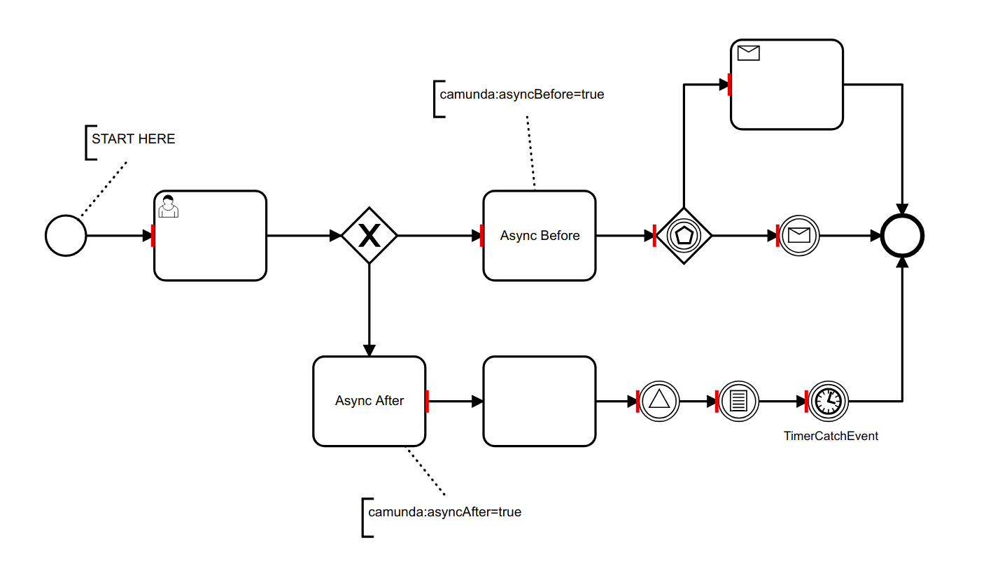

# bpmn-js-transaction-boundaries
A bpmn-js extension to visualize transaction boundaries



## Features

Visualize all transaction boundaries in a BPMN diagram.


This includes all BPMN elements that are wait states and have a boundary for incoming connections:

* Intermediate Catching Message Event
* Intermediate Catching Timer Event
* Intermediate Catching Signal Event
* Receive Task
* User Task
* Event Based Gateway

Furthermore all activities which have asynchronous continuations act as transaction boundaries. This is also valid for multi-instance activities.

Learn more about [transactions and wait states](https://docs.camunda.org/manual/latest/user-guide/process-engine/transactions-in-processes/).


## Usage

Extend the [bpmn-js](https://github.com/bpmm-io/bpmn-js) modeler with the transaction boundaries module:

```javascript

var BpmnModeler = require('bpmn-js/lib/Modeler');

var transactionBoundariesModule = require('bpmn-js-transaction-boundaries');

var canvas = $('#js-canvas');

var bpmnModeler = new BpmnModeler({
  container: canvas,
  additionalModules: [
    transactionBoundariesModule
  ]
});

bpmnModeler.importXML(xml, function(err) {

  if (err) {
      console.error(err);
    } else {
      var transactionBoundaries = bpmnModeler.get('transactionBoundaries');

      transactionBoundaries.show();
    }
  });

```

Please see [this example](https://github.com/bpmn-io/bpmn-js-examples/tree/master/transaction-boundaries) for a more detailed instruction.


## Test

```
npm install
npm test
```
